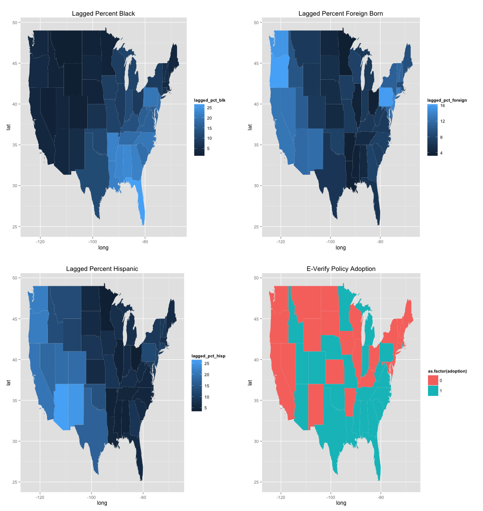
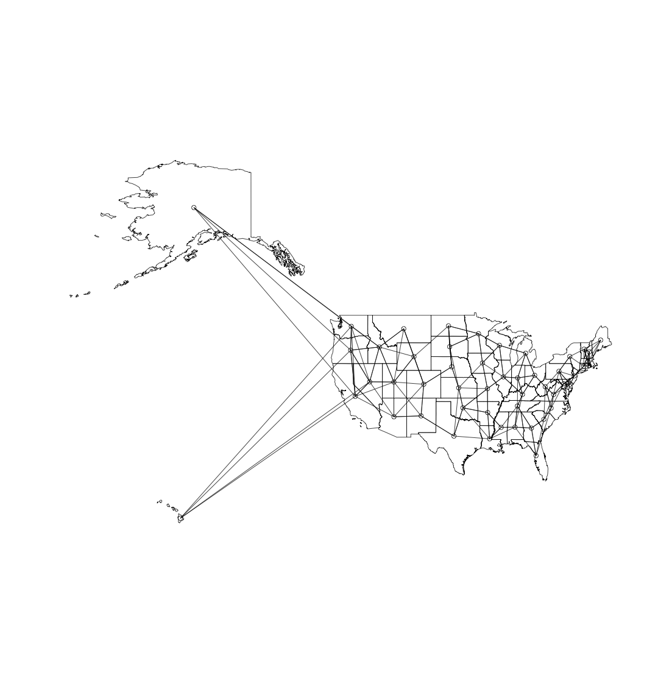

---
title: Safer Streets for Whom?
subtitle: Examining the Role of Deferential Social Control in the Gentrification-Crime Relationship
author: Chris E. Rees
job1: Doctoral Student in Sociology, SUNY-Albany
job2: Research Scientist, Center for Human Service Research
logo: University_at_Albany,_SUNY_Seal.svg.png
biglogo: University_at_Albany,_SUNY_Seal.svg.png
widgets: [mathjax, bootstrap, quiz]
#github: {user: cerees, repo: referral_procedures_slides}
mode: selfcontained
hitheme: tomorrow
assets: {js: 'test.js'}

---{
tpl: thankyou}

## Overview of Gentrification

---&footer

## WHAT is E-Verify?

>- 1996 Illegal Immigration Reform and Immigrant Responsibility Act 
>- Births variety of employment verification systems
>- Basic Pilot Program
>- Expanded by Bush taken over by DHS
>- States began to adopt it in 2006

---{
tpl: thankyou}

## Theory and Literature

---&footer

## HOW can we explain policy adoption?

>- Social Disorganization/Social Control
>- Routine Activites
>- Increased Public Surveillance

*** pnotes

I need to focus on the following

- Point 1
- Point 2
- Point 3

---&footer

## WHAT has been found in the literature?

>- No evidence of spatial diffusion
>- Some evidence for racial threat
>- Focus on threatening populations increase

---&footer

## WHAT is missing from the literature?

>- Understanding of what lies between gentrification and crime
>- Immigration is by nature the spatial diffusion of people
>- Need for an analysis that takes into account spatial arrangements

---&footer

##  SPATIAL CONTEXT & ADOPTION

---{
tpl: thankyou}

## Data and Methods

---&footer

## WHAT were the sources of data?

>- Level of Measurment
  - Sub-Burough
>- Sources of Data
  - NYPD's Stop, Question, and Frisk (SQF) Data
  - NYPD's Crime Data
  - Decenial and ACS Census Data
>- Measurement
  - Freeman's census based measurement of gentrification
  - Sampson's operationalization of concentrated disadvantage
  - Controls for nativity and residential turnover
>- Estimation
  - Fixed Effects

---&footer

##  SPATIAL OVERVIEW

---{
tpl: thankyou}

## Results

---&footer

## WHAT I found?

>- No significant local racial threat effects 
>- No evidence for spatial diffusion of the policy itself
>- Significant spatially lagged racial threat effects

---&footer

##  FINDINGS

---{
tpl: thankyou}

## Future Directions and Conclusions

---&footer

## WHAT comes next?

>- Theorizing spatially
>- Incorporating cultural measures of gentrification
>- Testing this in other cases of policy diffusion

---{
tpl: thankyou,
social: [{title: chris, href: "cerees@albany.edu"}, {title: web, href: "http://www.albany.edu/chsr/"}, {title: slides, href: "http://cerees.github.io/gentrification_and_social_control_slides"}]
}

## Thank You!

<!-- Limit image width and height -->

<!-- Center image on slide -->

